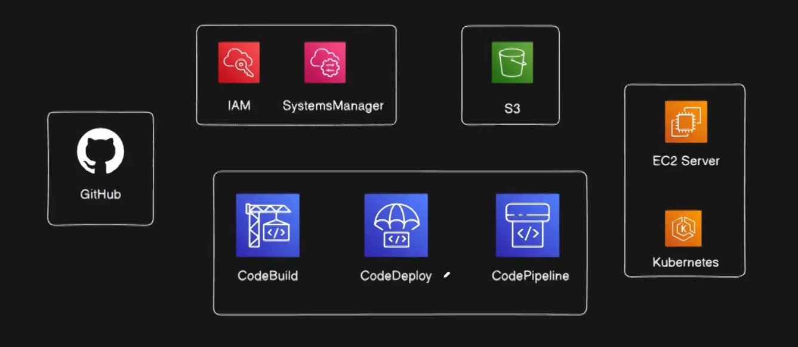

  

<h1>Rosyz CartOps – Single Tier E-Commerce Deployment on AWS</h1>

 <strong>Rosyz CartOps</strong> is a single-tier static sample e-commerce application built with HTML, CSS, and JavaScript, deployed on AWS using Docker and AWS DevOps services. This project demonstrates a real-world CI/CD workflow with secure credential handling and containerized deployment on EC2. 
 

 <h2>Architecture Overview</h2>

<strong>Supporting Services:</strong>
 

<ul> 
  <li>IAM (Roles & Permissions)</li> 
  <li>AWS Systems Manager (Parameter Store)</li>
  <li>EC2 Server</li>
  <li>Amazon S3 (Deployment Artifacts)</li> 
</ul> 

 <h2>Tech Stack</h2> <ul> <li><strong>Frontend:</strong> HTML, CSS, JavaScript</li> <li><strong>Containerization:</strong> Docker, Nginx</li> <li><strong>CI/CD:</strong> AWS CodePipeline, CodeBuild, CodeDeploy</li> <li><strong>Registry:</strong> Docker Hub</li> <li><strong>Compute:</strong> Amazon EC2 (Ubuntu)</li> <li><strong>Security:</strong> IAM, SSM Parameter Store</li> </ul> 

<h2>File Structure</h2>

    Rosyz-CartOps/
    │
    ├── index.html
    ├── style.css
    ├── script.js
    ├── Images/
    ├── futura.woff2
    │
    ├── Dockerfile
    ├── buildspec.yml
    ├── appspec.yml
    │
    └── scripts/
        ├── docker_installation.sh
        ├── stop_container.sh
        └── start_container.sh

<h2>Dockerfile</h2> 

    FROM nginx:alpine
    
    RUN rm -rf /usr/share/nginx/html/*
    
    COPY . /usr/share/nginx/html
    
    EXPOSE 80
    
    CMD ["nginx","-g","daemon off;"]

<h2>IAM Roles and Responsibilities</h2>

<h3>1. CodePipelineServiceRole</h3> 

    {
        "Version": "2012-10-17",
        "Statement": [
            {
                "Effect": "Allow",
                "Principal": {
                    "Service": "codepipeline.amazonaws.com"
                },
                "Action": "sts:AssumeRole"
            }
        ]
    }

Attached Policies

    AllowUseCodeStarConnection (Customer inline)
    
    AmazonS3FullAccess
    
    AWSCodeBuildDeveloperAccess
    
    AWSCodeBuildReadOnlyAccess
    
    AWSCodeDeployFullAccess
    
    AWSCodePipeline_FullAccess
    
    AWSProtonCodeBuildProvisioningBasicAccess
    
    UseCodeConnections (Customer inline)

<h3>2. CodeBuildServiceRole</h3> 

    {
        "Version": "2012-10-17",
        "Statement": [
            {
                "Effect": "Allow",
                "Principal": {
                    "Service": "codebuild.amazonaws.com"
                },
                "Action": "sts:AssumeRole"
            }
        ]
    }

Attached Policies

    AmazonS3FullAccess
    
    AmazonSSMFullAccess
    
    AWSCodeBuildDeveloperAccess
    
    AWSCodeBuildDeveloperAccess- (Customer inline)
    
    AWSCodeStarFullAccess
    
    CloudWatchLogsFullAccess
    
    CodeBuildBasePolicy-CodeBuildServiceRole

<h3>3. CodeDeployServiceRole</h3>  

    {
        "Version": "2012-10-17",
        "Statement": [
            {
                "Effect": "Allow",
                "Principal": {
                    "Service": "codedeploy.amazonaws.com"
                },
                "Action": "sts:AssumeRole"
            }
        ]
    }

Attached Policies

    AmazonEC2FullAccess
    
    AmazonS3FullAccess
    
    AWSCodeDeployFullAccess

<h3>4. EC2InstanceRole (Critical)</h3>

Trust Relationship

This trust policy allows EC2 to assume the role at instance startup.

    {
      "Version": "2012-10-17",
      "Statement": [
        {
          "Effect": "Allow",
          "Principal": {
            "Service": "ec2.amazonaws.com"
          },
          "Action": "sts:AssumeRole"
        }
      ]
    }

Attached Policies

    AmazonEC2ContainerRegistryFullAccess
    
    AmazonEC2ContainerRegistryReadOnly
    
    AmazonEC2RoleforAWSCodeDeploy
    
    AmazonS3FullAccess
    
    AmazonSSMFullAccess
    
    AWSCodeDeployDeployerAccess
    
    AWSCodeDeployFullAccess
    
    AWSCodeDeployReadOnlyAccess
    
    AWSCodeDeployRole

 

<h2>Secure Secret Management (SSM Parameter Store)</h2>

Docker Hub credentials are stored securely in AWS Systems Manager Parameter Store.
 <table border="1" cellpadding="6"> <tr>
  
<th>Parameter Name</th> <th>Type</th> </tr> <tr> <td>/rosyz/docker/username</td> <td>String</td> </tr> <tr> <td>/rosyz/docker/password</td> <td>SecureString</td> </tr> <tr> <td>/rosyz/docker/registry</td> <td>docker.io</td> </tr> </table> 

<h2>buildspec.yml (AWS CodeBuild)</h2>

    version: 0.2
    
    env:
      parameter-store:
        DOCKER_REGISTRY_USERNAME: /rosyz/docker/username
        DOCKER_REGISTRY_PASSWORD: /rosyz/docker/password
        DOCKER_REGISTRY_URL: /rosyz/docker/registry
    
    phases:
      install:
        commands:
          - echo "Install phase started"
          - docker --version
    
      pre_build:
        commands:
          - echo "Logging in to Docker Registry..."
          - echo "$DOCKER_REGISTRY_PASSWORD" | docker login -u "$DOCKER_REGISTRY_USERNAME" --password-stdin "$DOCKER_REGISTRY_URL"
          - IMAGE_REPO_NAME="rosyz-cartops"
          - IMAGE_NAME="$DOCKER_REGISTRY_USERNAME/$IMAGE_REPO_NAME"
    
      build:
        commands:
          - echo "Build started on $(date)"
          - echo "Building Docker image..."
          - docker build -t $IMAGE_NAME:latest .
    
      post_build:
        commands:
          - echo "Pushing Docker image..."
          - docker push $IMAGE_NAME:latest
          - echo "Creating deployment artifact..."
          - zip -r rosyz-cartops.zip .
          - echo "Build completed on $(date)"
    
    artifacts:
      files:
        - rosyz-cartops.zip
        - appspec.yml
        - scripts/**/*
      discard-paths: no

<h2>appspec.yml (AWS CodeDeploy)</h2> 

    version: 0.0
    os: linux
    
    files:
      - source: /
        destination: /home/ubuntu/rosyz-cartops
        overwrite: true
    
    file_exists_behavior: OVERWRITE
    
    hooks:
      ApplicationStop:
        - location: scripts/stop_container.sh
          timeout: 300
          runas: root
    
      ApplicationStart:
        - location: scripts/start_container.sh
          timeout: 300
          runas: root

<h2>Deployment Scripts</h2>

<h3>stop_container.sh</h3>

    #!/bin/bash
    echo "Stopping existing container..."
    
    docker stop rosyz-cartops || true
    docker rm rosyz-cartops || true

<h3>start_container.sh</h3> 

    #!/bin/bash
    set -e
    
    IMAGE_NAME="priyanshusingh10114/rosyz-cartops:latest"
    CONTAINER_NAME="rosyz-cartops"
    
    echo "Fetching Docker Hub credentials from SSM..."
    
    DOCKER_USER=$(aws ssm get-parameter \
      --name /rosyz/docker/username \
      --query Parameter.Value \
      --output text)
    
    DOCKER_PASS=$(aws ssm get-parameter \
      --with-decryption \
      --name /rosyz/docker/password \
      --query Parameter.Value \
      --output text)
    
    if [ -z "$DOCKER_USER" ] || [ -z "$DOCKER_PASS" ]; then
      echo "Docker Hub credentials are missing"
      exit 1
    fi
    
    echo "Logging in to Docker Hub..."
    echo "$DOCKER_PASS" | docker login -u "$DOCKER_USER" --password-stdin
    
    echo "Pulling image: $IMAGE_NAME"
    docker pull $IMAGE_NAME
    
    echo "Stopping old container if exists..."
    docker stop $CONTAINER_NAME || true
    docker rm $CONTAINER_NAME || true
    
    echo "Starting new container..."
    docker run -d \
      --name $CONTAINER_NAME \
      -p 80:80 \
      $IMAGE_NAME

<h2>S3 Bucket Creation for CI/CD Artifacts & Logs</h2>

Step 1: Create S3 Bucket

    Go to AWS Console → S3

Click Create bucket

Basic Configuration

Bucket name:

    rosyz-cartops-artifacts

Region:

    ap-south-1

Step 2: Object Ownership

    Select: ACLs disabled (recommended)
    
    Object ownership: Bucket owner enforced

Step 3: Block Public Access (IMPORTANT)

    Block all public access

This bucket should never be public.

Step 4: Bucket Versioning (Recommended)

    Enable Versioning

Step 5: Default Encryption

Enable encryption:

    Encryption type: SSE-S3
    
    Key type: Amazon S3 managed key (SSE-S3)

Step 6: Create Bucket
    
    Click Create bucket

<h2>EC2 Setup (Target Server)</h2>

<h3>Step 1: Launch EC2</h3> 

<ul> <li>AMI: Ubuntu 22.04 LTS</li> <li>Instance type: t2.micro</li> <li>Storage: 10 GB</li> </ul> <h3>Step 2: Security Group</h3> <ul> <li>Allow SSH (22) from your IP</li> <li>Allow HTTP (80) from 0.0.0.0/0</li> </ul>

<h4>After launching connect instance with ssh with local command prompt using .pem key</h4>

    sudo apt get update 

    sudo apt install docker.io -y

    sudo apt install nginx

Installing Docker and Docker Compose

    chmod +x docker_installation.sh
    ./docker_installation.sh
    sudo usermod -aG docker $USER
    sudo systemctl start docker

<h4>Install CodeDeploy Agent (Ubuntu)</h4>

    sudo apt update -y
    sudo apt install ruby wget -y
    
    wget https://aws-codedeploy-ap-south-1.s3.ap-south-1.amazonaws.com/latest/install
    chmod +x install
    sudo ./install auto

Start CodeDeploy Agent

    sudo service codedeploy-agent start

Check CodeDeploy Agent Status

    sudo service codedeploy-agent status

Expected output:

    active (running)

Restart CodeDeploy Agent

    sudo service codedeploy-agent restart

aws cli v2 Linux ubuntu 

    sudo apt install unzip
    curl "https://awscli.amazonaws.com/awscli-exe-linux-x86_64.zip" -o "awscliv2.zip"
    unzip awscliv2.zip
    sudo ./aws/install

To check aws version

    aws --version

AWS CodeBuild – Build Stage (Docker Image Build)

Step 1: Create IAM Role for CodeBuild

Trusted entity: codebuild.amazonaws.com

Attach policies:

    AWSCodeBuildDeveloperAccess
    
    AmazonS3FullAccess
    
    AmazonSSMFullAccess
    
    CloudWatchLogsFullAccess

Step 2: Create CodeBuild Project

    Go to AWS Console → CodeBuild → Create project
    
    Project name: rosyz-cartops-build
    
    Source:
    
    Provider: GitHub (via CodeStar Connection)
    
    Repository: priyanshusingh10114/rosyz-cartops
    
    Branch: main

    Environment:
    
    Managed image
    
    OS: Amazon Linux 2
    
    Image: aws/codebuild/standard:7.0
    
    Privileged mode: ENABLE (mandatory for Docker)
    
    Service role: select the CodeBuild IAM role
    
    Buildspec: use buildspec.yml from repository
    
    Artifacts:
    
    Type: S3 (handled automatically by CodePipeline)

Step 3: Verify CodeBuild

    Start build manually once
    
    Confirm:
    
    Docker image is built
    
    Image is pushed to Docker Hub
    
    Build status = Succeeded

AWS CodeDeploy – Deploy Stage (EC2 Deployment)

Step 1: Create IAM Role for CodeDeploy

    Trusted entity: codedeploy.amazonaws.com
    
    Attach policies:
    
    AWSCodeDeployFullAccess
    
    AmazonS3FullAccess
    
    AmazonEC2FullAccess

Step 2: Prepare EC2 Instance

    Ubuntu EC2 instance
    
    Security group allows:
    
    Port 22 (SSH)
    
    Port 80 (HTTP)
    
    Attach EC2 instance role
    
    Install:
    
    Docker
    
    AWS CLI v2
    
    CodeDeploy agent (running)

Step 3: Create CodeDeploy Application

    Go to CodeDeploy → Applications → Create application
    
    Name: rosyz-cartops-app
    
    Compute platform: EC2/On-premises

Step 4: Create Deployment Group

    Deployment group name: rosyz-cartops-dg
    
    Service role: CodeDeploy service role
    
    Deployment type: In-place
    
    Environment:
    
    EC2 instances (via tag or instance ID)
    
    Disable load balancer (single-tier app)

Step 5: appspec.yml

    Ensure appspec.yml exists in repo root and references:
    
    scripts/stop_container.sh
    
    scripts/start_container.sh

Step 6: Verify CodeDeploy

    Create a test deployment
    
    Check:
    
    ApplicationStop runs
    
    ApplicationStart runs
    
    Container starts on EC2

AWS CodePipeline – CI/CD Orchestration

Step 1: Create IAM Role for CodePipeline

    Create role using AWS service → CodePipeline
    
    Attach policies:
    
    AmazonS3FullAccess
    
    AWSCodeBuildDeveloperAccess
    
    AWSCodeDeployFullAccess
    
    AWSCodePipeline_FullAccess

Add inline policy:

    codestar-connections:UseConnection for GitHub connection ARN

Step 2: Create CodePipeline

    Go to CodePipeline → Create pipeline
    
    Pipeline name: rosyz-cartops-pipeline
    
    Service role: CodePipeline service role
    
    Artifact store:
    
    S3 bucket: rosyz-cartops-artifacts

Step 3: Source Stage

    Provider: GitHub (CodeStar Connection)
    
    Repository: priyanshusingh10114/rosyz-cartops
    
    Branch: main
    
    Output artifact: SourceArtifact

Step 4: Build Stage

    Provider: AWS CodeBuild
    
    Project: rosyz-cartops-build
    
    Input artifact: SourceArtifact
    
    Output artifact: BuildArtifact

Step 5: Deploy Stage

    Provider: AWS CodeDeploy
    
    Application name: rosyz-cartops-app
    
    Deployment group: rosyz-cartops-dg
    
    Input artifact: BuildArtifact

Step 6: Release Pipeline

    Click Release change
    
    Pipeline flow:
    
    Source → Build → Deploy
    
    All stages should turn green
    
    Final Verification
    
    On EC2:
    
    docker ps

In browser:

    http://<EC2_PUBLIC_IP>

Application should load successfully.
    

<h2>Final Outcome</h2> <ul> <li>Docker image successfully built and pushed</li> <li>EC2 pulls the latest image from Docker Hub</li> <li>Nginx serves the e-commerce application</li> <li>Deployment completes successfully</li> </ul> 
 

<h2>Author</h2>

 <strong>Priyanshu Singh</strong>  DevOps | AWS | Docker | Cloud 

